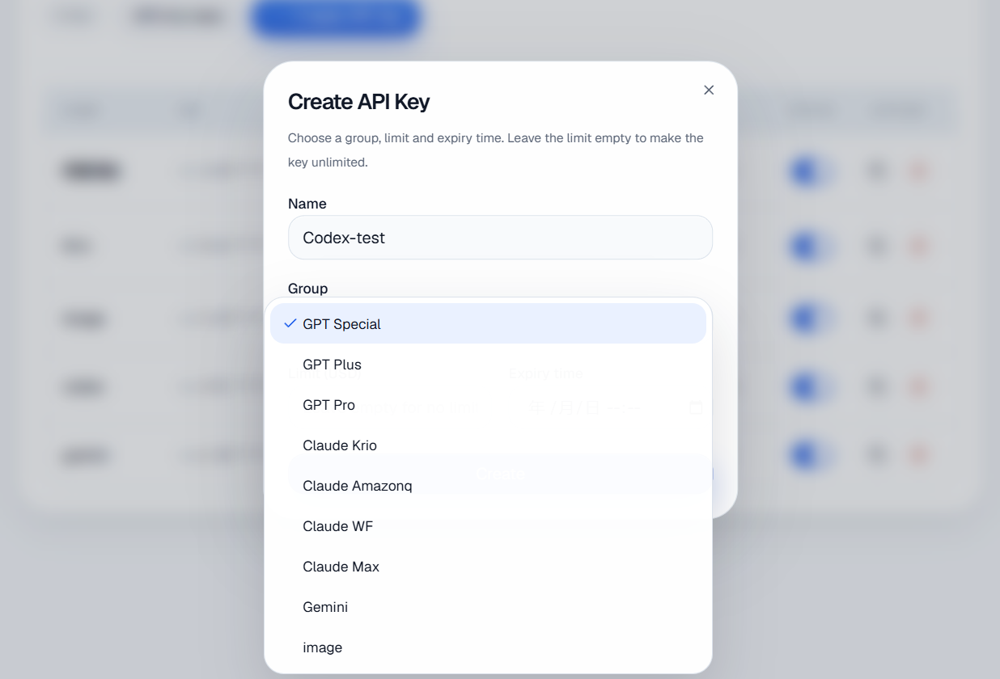
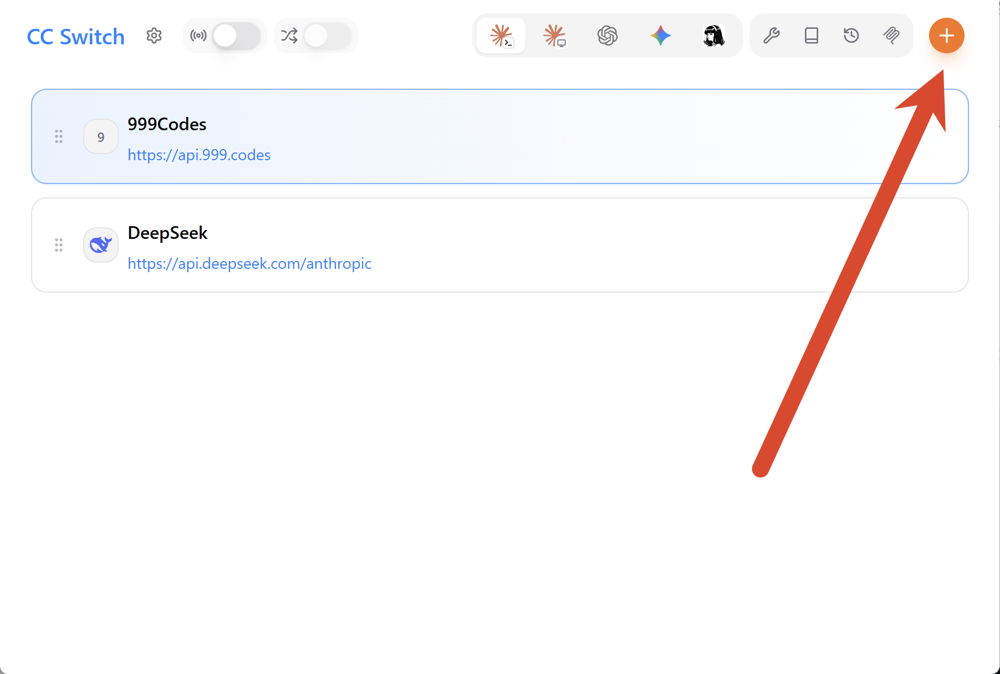
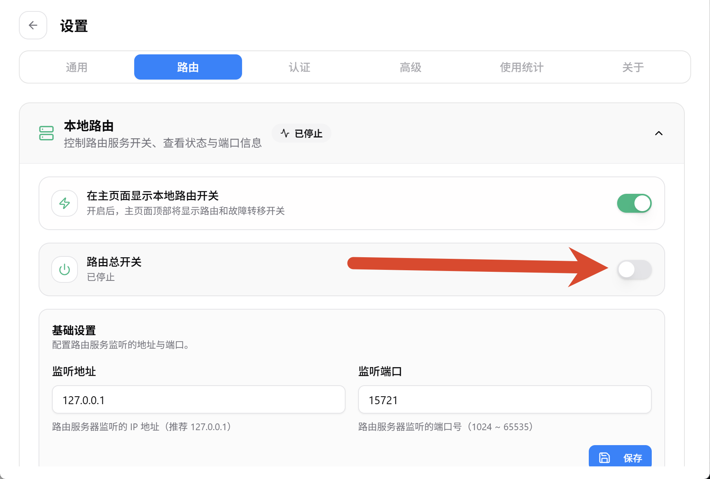
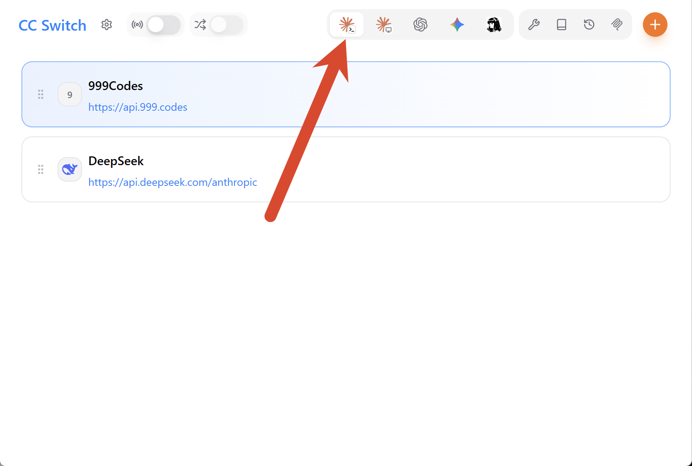

> **适用工具：** Codex CLI（OpenAI）、Claude Code CLI（Anthropic）  
> **中转平台：** [999.Codes](https://999.codes/)（兼容 OpenAI API 的中转服务）  
> **管理工具：** [CC-Switch](https://github.com/farion1231/cc-switch)（开源 API 配置管理桌面应用）  
> **适用人群：** 已安装 Codex 或 Claude Code，想接入国内可用的 API 中转站

---

## 目录

1. [为什么要用中转站 + CC-Switch？](#1-为什么要用中转站--cc-switch)
2. [准备工作](#2-准备工作)
3. [第一步：注册 999Codes 并创建 API Key](#3-第一步注册-999codes-并创建-api-key)
4. [第二步：安装 CC-Switch](#4-第二步安装-cc-switch)
5. [第三步：在 CC-Switch 中配置 999Codes](#5-第三步在-cc-switch-中配置-999codes)
6. [第四步：应用到 Codex CLI](#6-第四步应用到-codex-cli)
7. [第五步：应用到 Claude Code](#7-第五步应用到-claude-code)
8. [CC-Switch 进阶用法](#8-cc-switch-进阶用法)
9. [常见问题](#9-常见问题)
10. [999Codes 模型与价格参考](#10-999codes-模型与价格参考)

---

## 1. 为什么要用中转站 + CC-Switch？

### 中转站解决什么问题？

国内无法直接访问 OpenAI 和 Anthropic 的 API。中转站（如 999Codes）提供了一条"中间通道"：

```
你的电脑 → 中转站（国内可访问） → OpenAI/Anthropic 官方 API
```

### CC-Switch 解决什么问题？

- 不用手动改配置文件（`config.toml`、`settings.json`）
- 可视化切换 API 供应商和模型
- 一个工具同时管理 Codex 和 Claude Code
- 支持一键切换多个供应商，方便对比使用

---

## 2. 准备工作

在开始之前，请确保：

- ✅ 已安装 **Codex CLI** 或 **Claude Code CLI**（参考前几篇教程）
- ✅ 已有中转站账号，这里以999Codes为例（[https://999.codes](https://999.codes)）
- ✅ 已为账户充值

---

## 3. 第一步：注册 999Codes 并创建 API Key

### 3.1 注册登录

打开 [https://999.codes](https://999.codes)，注册账号并登录。

### 3.2 查看仪表盘

登录后进入 Dashboard，可以看到：
- **Balance**（余额）
- **Requests today / Tokens today / Spend today**（今日用量）
- **API Address**：`https://api.999.codes/v1`
- **模型分组**：GPT Special、GPT Plus、GPT Pro、Claude Krio、Claude Amazonq、Claude WF、Claude Max、Gemini、Image

**[需插入图片：Dashboard 总览页面截图，标注 API Address 和模型分组]**

### 3.3 创建 API Key

进入 **API Keys** 页面（在顶部菜单）：

1. 点击 **"Create API Key"**
2. 输入名称（如 "codex-test"）
3. 选择 **模型分组（Group）**
   - 给 Codex 用 → 选 **GPT Special**
   - 给 Claude Code 用 → 选 **Claude Krio / Claude Amazonq / Claude Max** 之一
4. 设置额度限制（可选）
5. 创建后复制 API Key（格式如 `sk-xxxx`）



> ⚠️ **重要：每个 API Key 只能访问指定模型分组内的模型。** 比如选了 GPT Special 的 Key 不能调 Claude 模型。如果需要用多个分组，创建多个 Key 即可。

---

## 4. 第二步：安装 CC-Switch

### 下载

从 GitHub Releases 下载对应系统的版本：

- **GitHub 地址**：<https://github.com/farion1231/cc-switch/releases>
- 国内镜像加速：使用 `ghproxy.com` 前缀

| 系统 | 下载文件 |
|------|---------|
| **Windows** | `CC-Switch_x.x.x_x64-setup.exe` 或 `.msi` |
| **macOS（Apple Silicon）** | `CC-Switch_x.x.x_aarch64.dmg` |
| **macOS（Intel）** | `CC-Switch_x.x.x_x64.dmg` |

### 安装

**Windows：** 双击 `.exe` 或 `.msi`，按向导安装。

**macOS：**
1. 双击 `.dmg` 文件
2. 将 CC-Switch 拖入 Applications 文件夹
3. 首次打开如提示安全验证，去 **系统设置 → 隐私与安全性 → 仍要打开**

---

## 5. 第三步：在 CC-Switch 中配置 中转站

### 5.1 添加自定义供应商

打开 CC-Switch，界面分为左右两栏：
- **左侧**：工具列表（Codex / Claude Code / Gemini CLI）
- **右侧**：当前工具的供应商配置



**以 Codex 为例：**

1. 左侧点击 **Codex**
2. 右侧点击 **"Add Provider"**（或 + 号）
3. 在弹出的窗口中：

| 字段 | 填写内容 |
|------|---------|
| 供应商名称 | `999Codes`（自定义） |
| API Base URL | `https://api.999.codes/v1` |
| API Key | 你在 999Codes 创建的 API Key（`sk-xxx`） |

**[需插入图片：CC-Switch 添加 Provider 的弹窗截图，标注各字段填写内容]**

### 5.2 高级设置（可选）

CC-Switch 支持更多配置项：

- **启用 Proxy**：开启本地代理模式（Codex使用Deepseek时必开）

  

- **Auto Failover**：自动故障转移，一个供应商失败自动切到另一个

- **用量统计**：查看每个 Key 的消耗情况

### 5.3 启用配置

填写完成后，点击 **"Enable"**（启用）按钮。CC-Switch 会自动写入对应的配置文件，无需手动操作。

---

## 6. 第四步：应用到 Codex CLI

### 6.1 通过 CC-Switch 配置（推荐）

在 CC-Switch 左侧选择 **Codex**，确保已添加并启用 999Codes Provider。

CC-Switch 会自动创建以下配置文件：

**`~/.codex/config.toml`：**
```toml
model_provider = "999_codes"
model = "gpt-5.4"
review_model = "gpt-5.4"
model_reasoning_effort = "xhigh"
disable_response_storage = true
network_access = "enabled"
windows_wsl_setup_acknowledged = true

[model_providers.999_codes]
name = "999.Codes"
base_url = "https://api.999.codes/v1"
wire_api = "responses"
requires_openai_auth = true
```

**`~/.codex/auth.json`：**
```json
{
  "OPENAI_API_KEY": "sk-你的Key"
}
```

### 6.2 手动配置（如果不使用 CC-Switch）

手动创建上述两个文件，填入对应内容即可。

### 6.3 验证

```bash
# 进入项目目录
cd 你的项目

# 启动 Codex
codex
```

如果看到提示 `Provider: 999.Codes` 且正常进入对话界面，说明配置成功。

### 推荐模型搭配

| 用途 | 推荐模型 | 分组 |
|------|---------|------|
| 日常编程 | `gpt-5.4` | GPT Special |
| 代码审查 | `codex-auto-review` | GPT Special |
| 复杂任务 | `gpt-5.5` | GPT Special |
| 轻量快速 | `gpt-5.4-mini` | GPT Special |

---

## 7. 第五步：应用到 Claude Code

### 7.1 通过 CC-Switch 配置

在 CC-Switch 左侧选择 **Claude Code**。



点击 **"Add Provider"，选择自定义配置：

| 字段 | 填写内容 |
|------|---------|
| Name | `999Codes-Claude` |
| API Base URL | `https://api.999.codes/v1` |
| API Key | 你在 999Codes 创建的 Claude 分组 Key |
高级设置中可以点击获取模型列表手动选择Sonnet、Opus、Haiku使用哪个模型

> ⚠️ **注意：** 给 Claude Code 用的 API Key，创建时 Group 要选 **Claude Krio**、**Claude Amazonq**、**Claude WF** 或 **Claude Max** 其中之一，不能选 GPT 分组。

### 7.2 手动配置（不使用 CC-Switch）

如果手动配置，编辑 `~/.claude/settings.json`：

```json
{
  "env": {
    "ANTHROPIC_AUTH_TOKEN": "sk-你的Key",
    "ANTHROPIC_BASE_URL": "https://api.999.codes/v1",
    "ANTHROPIC_MODEL": "claude-sonnet-4-6"
  }
}
```

### 7.3 验证

```bash
cd 你的项目
claude
```

正常进入会话即成功。

### 推荐模型搭配

| Claude 分组 | 特点 |
|-------------|------|
| **Claude Krio** |  性价比之选 |
| **Claude Amazonq** | Amazon 渠道 |
| **Claude Max** | Claude Code Max官转，价格最高 |

---

## 8. CC-Switch 进阶用法

### 8.1 多供应商切换

CC-Switch 可以添加多个供应商，随时切换：

1. 添加多个 Provider（如 999Codes + DeepSeek + 官方 API）
2. 点击对应 Provider 的 **"Enable"** 即可切换
3. 切换后重新打开 Codex / Claude Code

### 8.2 同时管理多个工具

左侧列表可以分别配置：
- **Codex** → 配置 999Codes GPT 分组
- **Claude Code** → 配置 999Codes Claude 分组
- **Gemini CLI** → 配置 Google 或其他供应商

互不干扰，各用各的 Key。

### 8.3 Proxy 模式（高级）

开启 Proxy 后，CC-Switch 会启动一个本地代理服务器：
- 每个工具连接本地地址，由 CC-Switch 转发到实际 API
- 优点：无需修改工具的配置文件，切换更丝滑
- 适合：频繁切换供应商的用户

---

## 9. 常见问题

### Q1：添加 Provider 后 Codex 还是连不上

**排查步骤：**
1. 确认 API Key 未过期、有额度
2. 确认 Key 的分组跟使用的模型匹配（GPT Key → GPT 模型）
3. 在 CC-Switch 中点击 "Disable" 再重新 "Enable"
4. 重启终端 / 重启 Codex

### Q2：CC-Switch 提示 "Connection failed"

**解决：**
- 检查网络是否能访问 `api.999.codes`
- 检查 API Base URL 是否正确（必须是 `https://api.999.codes/v1`）
- 试试在浏览器直接访问 `https://api.999.codes/v1/models`（需带 Key）

### Q3：Claude Code 报 "Authentication failed"

**解决：**
- 确认 `settings.json` 中的字段是 `ANTHROPIC_AUTH_TOKEN` 而不是 `ANTHROPIC_API_KEY`
- 确认 API Key 是在 Claude 分组下创建的，而不是 GPT 分组
- 在 999Codes 后台检查 Key 的状态是否 Active

### Q4：模型响应慢或报错 429

**解决：**
- 检查 999Codes 余额是否充足
- 降级使用更便宜的模型（如 `gpt-5.4-mini`）
- 联系 999Codes 客服了解当前负载

### Q5：CC-Switch 打不开或闪退

**解决：**
- 从 GitHub Releases 下载最新版本
- Windows 用户安装 [WebView2 Runtime](https://developer.microsoft.com/microsoft-edge/webview2/)
- macOS 用户确保系统版本 ≥ 12

### Q6：如何给 Codex 和 Claude Code 用不同的 Key？

在 CC-Switch 中：
1. 左侧选 **Codex** → 添加 999Codes（使用 GPT 分组的 Key）
2. 左侧选 **Claude Code** → 添加 999Codes（使用 Claude 分组的 Key）
3. 分别启用即可

---

## 10. 999Codes 模型与价格参考

> 价格以官网实时显示为准，以下为参考数据。

### GPT Special 分组（适合 Codex）

| 模型 | 输入 ($/1M tokens) | 缓存输入 ($/1M) | 输出 ($/1M) |
|------|-------------------|----------------|------------|
| `gpt-5.4` | $0.30 | $0.03 | $1.80 |
| `gpt-5.4-mini` | $0.09 | $0.009 | $0.54 |
| `gpt-5.3-codex` | $0.21 | $0.021 | $1.68 |
| `gpt-5.2` | $0.21 | $0.021 | $1.68 |
| `gpt-5.5` | $0.60 | $0.06 | $3.60 |
| `codex-auto-review` | $0.30 | $0.03 | $1.80 |

### Claude Max 分组（适合 Claude Code）

| 模型 | 输入 ($/1M tokens) | 缓存输入 ($/1M) | 输出 ($/1M) |
|------|-------------------|----------------|------------|
| `claude-haiku-4-5` | $225 | — | $1,125 |
| `claude-haiku-4-5-20251001` | $3 | $0.30 | $15 |
| `claude-sonnet-4-5-20250929` | $9 | $0.90 | $45 |
| `claude-sonnet-4-6` | $9 | $0.90 | $45 |
| `claude-opus-4-5-20251101` | $15 | $1.50 | $75 |
| `claude-opus-4-6` | $15 | $1.50 | $75 |
| `claude-opus-4-7` | $15 | $1.50 | $75 |
| `claude-opus-4-8` | $15 | $1.50 | $75 |

> 注意：Claude 分组的价格比 GPT 分组高一个数量级，请根据需求合理选择。

---

## 总结

```
注册 999Codes → 创建 API Key → 安装 CC-Switch → 添加 Provider → 启动 Codex/Claude Code
```

整个过程约 **5 分钟**，之后你可以：
- 在 CC-Switch 中一键切换供应商
- 同时管理 Codex 和 Claude Code
- 随时查看用量和花费

---

> **参考资料：**
> - 999Codes：<https://999.codes>
> - CC-Switch GitHub：<https://github.com/farion1231/cc-switch>
> - CC-Switch 下载：<https://github.com/farion1231/cc-switch/releases>
